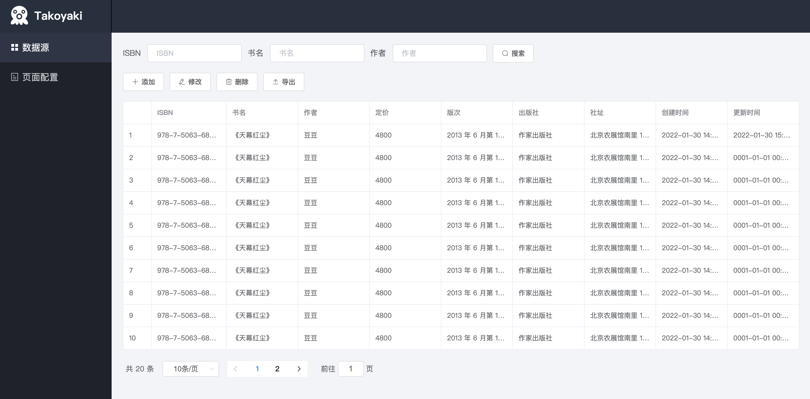

# takoyaki

**takoyaki** 是一个通用的数据表格组件，0 配置，开箱即用。支持快速生成可视化管理平台，对数据表进行基本的 “**增删改查**”。
其受启发于业务场景，将常见的数据管理功能，抽离成通用的组件，目的是减少的重复开发工作，进一步帮助开发人员形成一种抽象的软件思维。

Blog：https://www.cnblogs.com/marszuo/p/15858376.html

## 产品图



## 演示视频

Todo:

## 部署

前端页面已经编译打包到 **backend/dist** 路径，只需启动后台 `web` 服务即可：

```shell
cd backend
go run main
```

### License

The project is licensed under the Apache 2 license.
