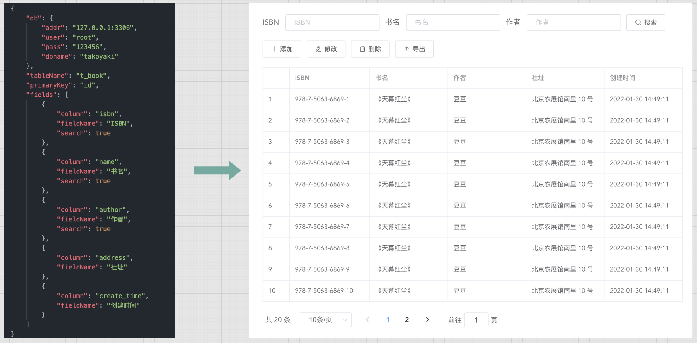

# takoyaki

**takoyaki** 是一个通用的数据表格组件，只需少量的配置，无需人力开发，就可以快速生成一个常见的支持业务 “**增删改查**” 的 Web 管理平台。
其受启发于业务场景，将常见的数据管理功能，抽离成通用的组件，目的是减少的重复开发工作，进一步帮助开发人员形成一种抽象的软件思维。

## 产品图

## 部署

1. 配置文件 `conf/config.json`，需配置数据库实例，数据表以及要展示的字段。
2. 静态页面在 `frontend/dist` 目录下，是使用 `vue-cli` 编译生成，可以省去 `nodejs` 环境安装。
3. 后台服务是一个 `web` 服务器，提供静态页面托管以及数据接口，使用 `go run main.go` 命令启动服务。

### License

The project is licensed under the Apache 2 license.
